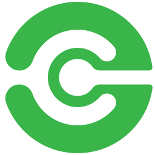

    

<h1 align="center">Dockey</h1>

    <em>an integrated graphic user interface tool for molecular docking and virtual screening</em>

    
    
    
    

    
    

## Introduction

Computer-aided drug design (CADD) has become one of the most efficient methods to greatly reduce the costs and time as well as the attrition rates for identification of promising drug candidates. CADD can be broadly divided into structure-based and ligand-based drug design approaches. Molecular docking is the most widely used structure-based CADD approach to assist in streamlining and accelerating the overall drug discovery process. The goal of molecular docking is to predict the preferred conformation, affinity and interaction of a ligand within the binding site of a macromolecular with the aid of computational tools. AutoDock and its variants are the most popular docking tools for study of protein-ligand interactions and virtual screening. We developed Dockey, a novel graphical user interface tool with seamless integration of several external tools that implements a complete streamlined docking pipeline including molecular preparation, paralleled docking execution, interaction detection and conformation visualization.

## Features

- Support for pdb, mol, mol2, sdf and other formats that can be identified by [OpenBabel](http://openbabel.org/docs/current/FileFormats/Overview.html).
- Support for Windows, Linux and MacOS systems
- Applicable to AutoDock4, AutoDock Vina and QuickVina-W
- Automatically dock thousands of ligands to multiple receptors in parallel
- Detection of non-covalent protein-ligand interactions
- Visualization of receptors, ligands, complexes and interactions
- Single project file for easy sharing between any systems and computers

## Integrated tools

- [Pymol](https://pymol.org)
- [OpenBabel](http://openbabel.org)
- [RDKit](https://www.rdkit.org)
- [Meeko](https://github.com/forlilab/Meeko)
- [Plip](https://github.com/pharmai/plip)
- [AutoDockTools](https://github.com/lmdu/AutoDockTools_py3)

## Docking engines

- [AutoDock4](https://autodock.scripps.edu)
- [AutoDock Vina](https://github.com/ccsb-scripps/AutoDock-Vina)
- [QuickVina-W](https://qvina.github.io/)

## Usage

The documentation is available here: [https://dockey.readthedocs.io/en/latest](https://dockey.readthedocs.io/en/latest/)

## Download

You can download the latest installer for Windows, Linux and MacOS from [https://github.com/lmdu/dockey/releases](https://github.com/lmdu/dockey/releases)
