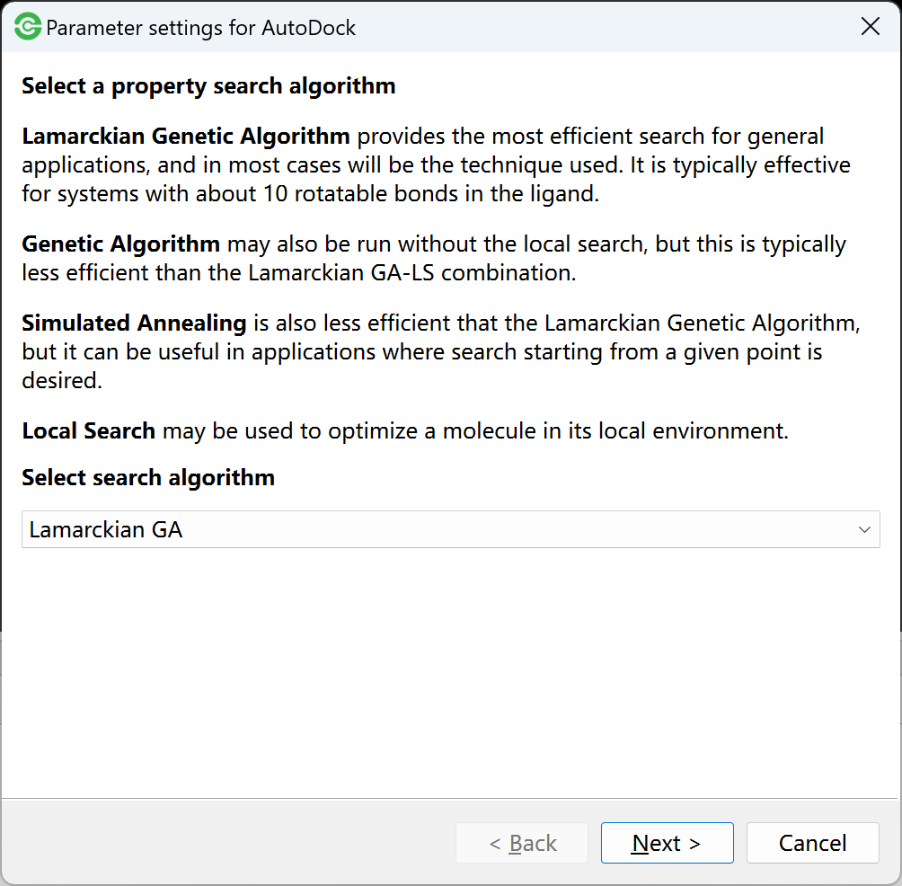
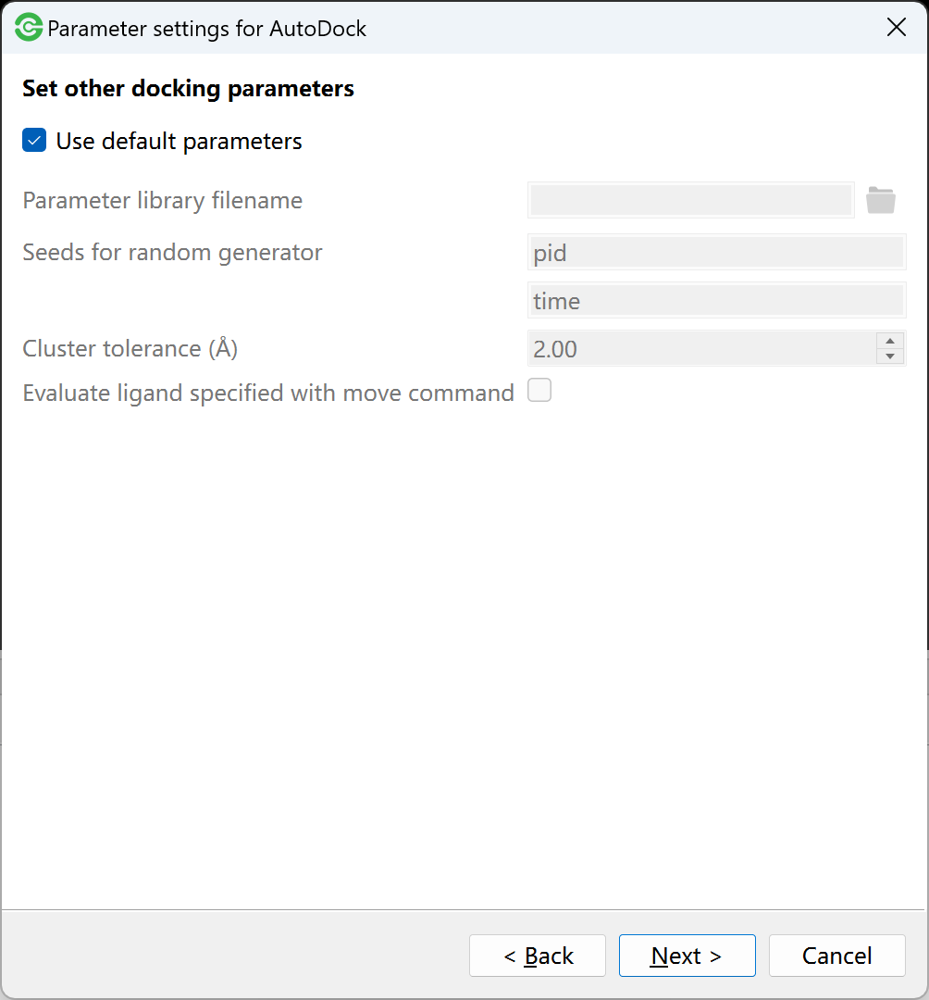
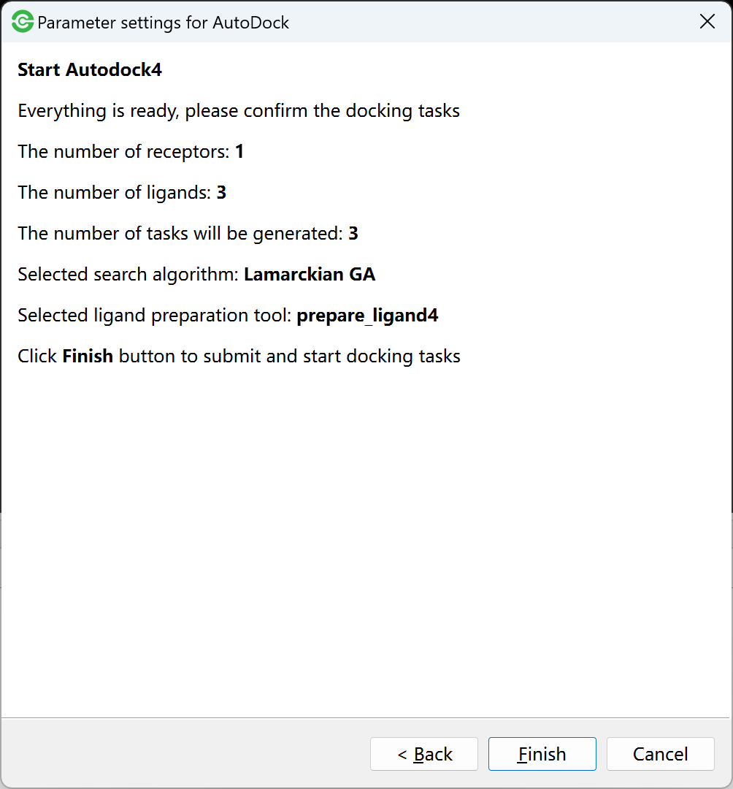
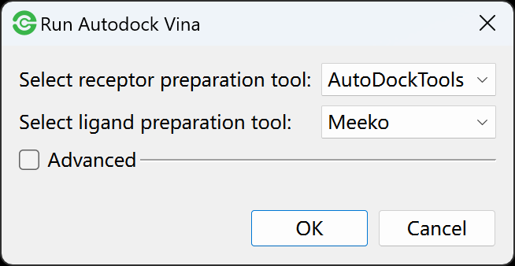
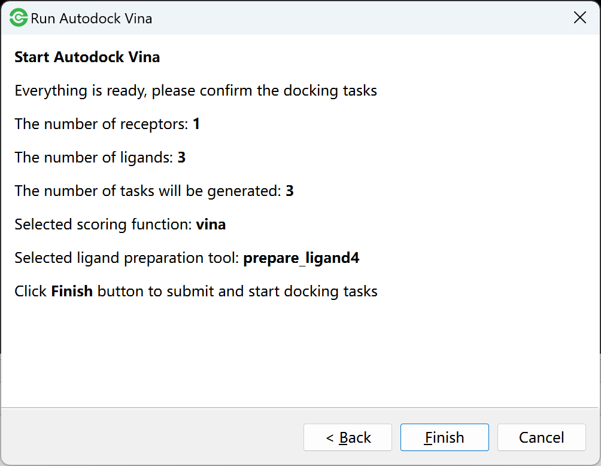
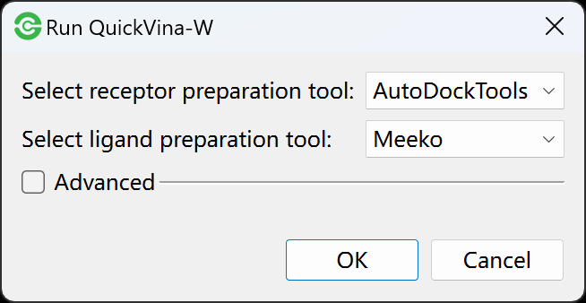
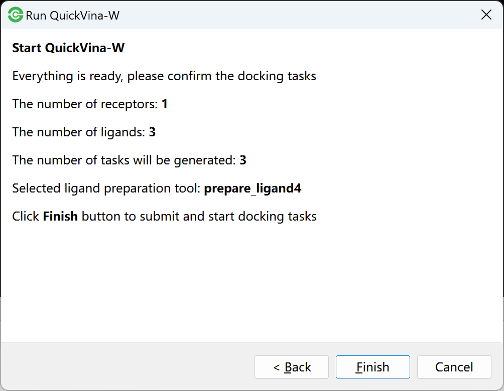
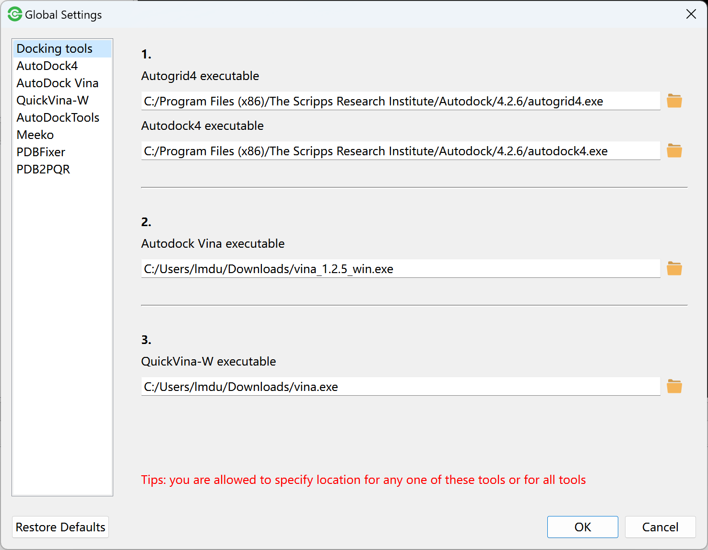
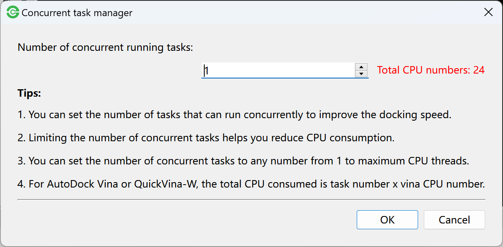

Molecular Docking
=================

Docking engines
---------------

Firstly, you should specify the location of docking engines to ensure that the Dockey can invoke the docking engines.

Go to **Edit** menu -> **Settings** -> **Docking tools** tab to open the docking engine setting dialog in where you can select the path of docking engines.

.. rst-class:: wy-text-center

	|docker|

You can click on |folder| to select the executable binary file for tools. You are allowed to select any of Autodock4, Autodock Vina and QuickVina-W to specify the location of tool. For Autodock4, you must specify the location of autodock4 and autogrid4.

Search space
------------

Before running molecular docking, you can specify search space for receptor by adjusting grid box size and position. **Otherwise, the whole space of receptor will be used as default search space**.

#. You can go to **Grid** menu -> **Draw Bounding Box** to draw a grid box enveloping the whole receptor.

#. You can go to **Grid** menu -> **Draw Residue Centered Box** to select a residue and draw a grid box centered on that residue.

#. You can also go to **Grid** menu -> **Draw Custom Box** to draw a grid box whose size and position can be adjusted through gridbox panel.

.. rst-class:: wy-text-center

	|grid|

In gridbox panel, you can change the face color and border width of box. The value of spacing, number of points in each dimension (x, y, z), centre coordinates (x, y, z) can be increased and decreased with mouse wheel while hovering over or focusing on input field.

You are allowed to observe the box size and position in PyMOL view.

.. note::

	The value of points in each dimension must be even number. Don't forget to click **Save grid box** button after setting grid box.

Performing basic docking
------------------------

Currently, Dockey supports three docking engines: AutoDock4, AutoDock Vina and QuickVina-W. You can only select one of them to perform docking. When docking finished, if you select another engine to dock, the previous docked results will be automatically deleted.

Run AutoDock4
~~~~~~~~~~~~~

Go to **Run** menu -> **AutoDock** to start AutoDock4 docking. If Dockey has completed docking jobs, you will be prompted with a dialog box asking whether or not to delete the previous jobs and docking results, and genreate new docking jobs.

.. rst-class:: wy-text-center

	|taskdlg|

There are four steps to start AutoDock4. You can click ``<Back`` or ``Next>`` button in each page to switch step. At last, you can click ``Finish`` button to generate job queue and start docking jobs.

**Step 1**, select a search algorithm: Genetic Algorithm (GA), Lamarckian GA, Simulated Annealing or Local Search. 

.. rst-class:: wy-text-center

	|ad1|

.. note::

	Lamarckian GA is most widely used search algorithm.

**Step 2**, set parameters for selected algorithm. You can use default parameters or uncheck ``Use default paramters`` to adjust parameters. 

.. rst-class:: wy-text-center

	|ad2|

**Step 3**, set other docking parameters.

.. rst-class:: wy-text-center

	|ad3|

**Step 4**, confirm docking jobs, you will get the number of docking jobs.

.. rst-class:: wy-text-center

	|ad4|

.. note::

	The meanings of above parameters can be found in `AutoDock4 manual <https://autodock.scripps.edu/wp-content/uploads/sites/56/2021/10/AutoDock4.2.6_UserGuide.pdf>`_. For simplicity, you can use the default value of parameters.

Run AutoDock Vina
~~~~~~~~~~~~~~~~~

AudoDock Vina is more simple than AutoDock4, only two steps need to start Vina.

**Step 1**, set docking parameters for AutoDock Vina. Using default parameters is Ok.

.. rst-class:: wy-text-center

	|vina1|

**Step 2**, comfirm docking jobs.

.. rst-class:: wy-text-center

	|vina2|

Run QuickVina-W
~~~~~~~~~~~~~~~

Similar to AutoDock Vina, QuickVina-W also needs two steps.

**Step 1**, set docking parameters for QuickVina-W. Using default parameters is Ok.

.. rst-class:: wy-text-center

	|qvinaw1|

**Step 2**, comfirm docking jobs.

.. rst-class:: wy-text-center

	|qvinaw2|

Performing flexible docking
---------------------------

Before performing flexible docking, you should specify flex residues for receptors. In molecular list, right-click a receptor, go to **Specify Flexible Residues** menu to open dialog:

.. rst-class:: wy-text-center

	|flexres|

In the residule list, select residues as flexible residues. In addition, you can check **Select bonds to disallowed** and click a flexible residue to select some bonds to disallowed.

.. rst-class:: wy-text-center

	|flexbond|

The Dockey will automatically split the receptor coordinates into two PDBQT files (one for the rigid portion and one for the flexible side chains) according to the selected flexible residues.

After specification of flexible residues, you can follow the performing basic docking steps to start flexible docking.

Docking tasks
-------------

After setting finished for one of docking engines, the each ligand will be docked to each receptor, the generated task queue can be viewed in task table.

.. rst-class:: wy-text-center

	|jobtb|

In task table, you can view the status and progress of each docking task. The status includes waiting, running, success, failure and stopped.

You are allowed to view the start time and end time of task by using **View Current Task** in task table right-click menu.

.. rst-class:: wy-text-center

	|jobdt|

You are allowed to use **Stop Current Task** to stop the running task. Note that the stopped task can not be restarted.

You can use **View Task Counts** to view the number of tasks.

.. rst-class:: wy-text-center

	|jobnum|

Parallel docking
----------------

The Dockey allows more than one job to run concurrently. You can go to **Task** menu -> **Settings** -> **Concurrent Task Manager** to open setting dialog and then set the number of jobs that can run concurrently.

.. rst-class:: wy-text-center

	|jobmg|

.. note::

	The more concurrent running jobs will consume more computing resources including CPUs and Memory. Generally, the number of parallel jobs is less than the maximum number of CPUs.

CPU and memory usage
--------------------

Go to **Toolbar** -> click |cpu| to open computing resource usage dialog where you can view the CPU and memory used by Dockey.

.. rst-class:: wy-text-center

	|cpumem|

