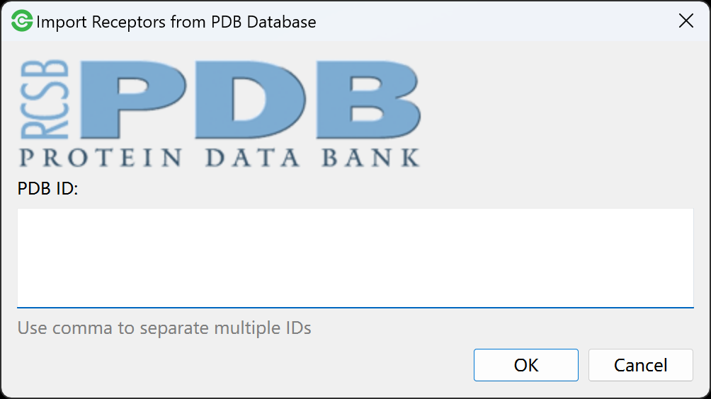
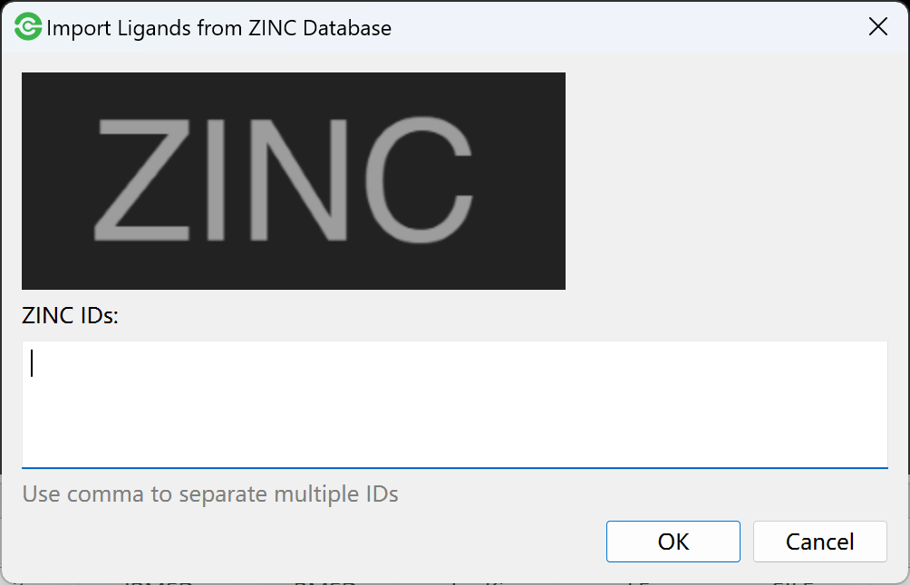
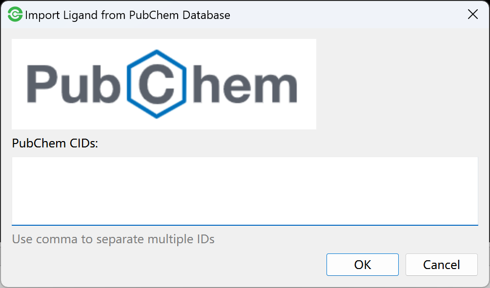
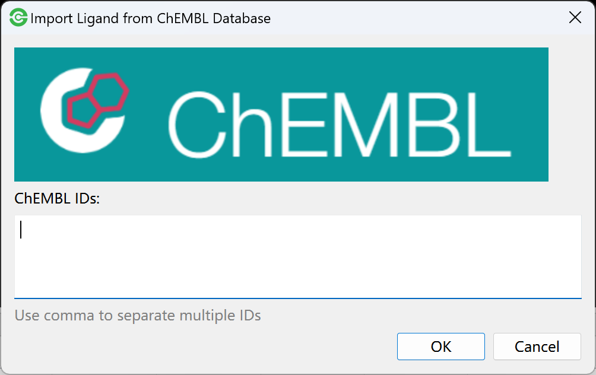
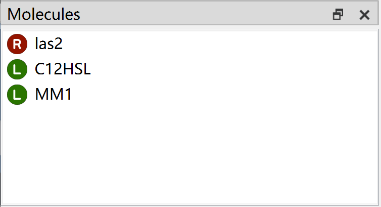
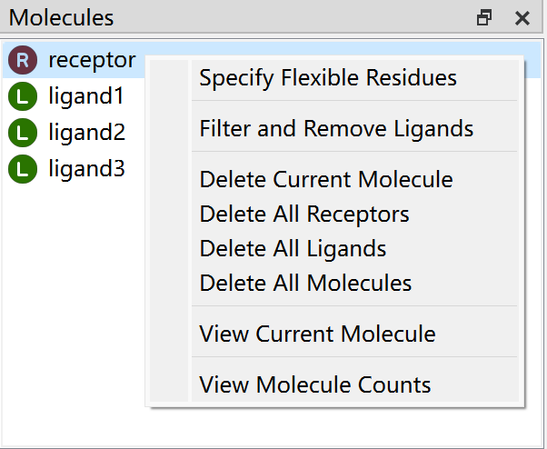
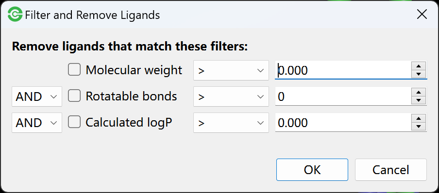
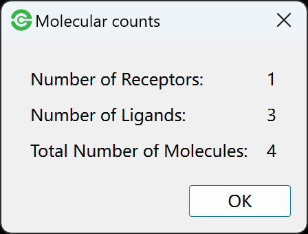

Import molecules
================

After creating or opening project file, you will be allowed to import receptors and ligands. The Dockey supports various formats that can be read by `OpenBabel <http://openbabel.org/docs/current/FileFormats/Overview.html>`_.

.. note::

	The Dockey will identify molecule file format through extension name. Please make sure that the molecule file extension is identical with its content.

Import Receptors
----------------

Import from local file
^^^^^^^^^^^^^^^^^^^^^^

Go **File** menu -> **Import Receptors** to select receptor files and click **Open** to import into Dockey.

Import from PDB database
^^^^^^^^^^^^^^^^^^^^^^^^^^^

Go **File** menu -> **Import Receptor from Database** -> **PDB** to open a dialog:

.. rst-class:: wy-text-center

	|pdb|

Then input PDB IDs using comma to separate multiple ones and click ``OK`` button. The Dockey will automatically download the molecule from `RCSB PDB <https://www.rcsb.org/>`_ database and import it.

Import Ligands
--------------

Import from local file
^^^^^^^^^^^^^^^^^^^^^^

Go **File** menu -> **Import Ligands** to select ligand files and import to Dockey.

Import from SDF file
^^^^^^^^^^^^^^^^^^^^

If you want to import all ligands from SDF file database. You can go to **File** menu -> **Import Ligand from Database** -> **SDF** to select the sdf file with multiple molecules to import.

Import from Zinc database
^^^^^^^^^^^^^^^^^^^^^^^^^

Go **File** menu -> **Import Ligand from Database** -> **Zinc** to open a dialog:

.. rst-class:: wy-text-center

	|zinc|

Then input Zinc IDs using comma to separate multiple ones and click ``OK`` button. The Dockey will automatically download the molecule from `Zinc <https://zinc.docking.org/>`_ database and import it.

Import from PubChem database
^^^^^^^^^^^^^^^^^^^^^^^^^^^^

Go **File** menu -> **Import Ligand from Database** -> **PubChem** to open a dialog:

.. rst-class:: wy-text-center

	|pubchem|

Then input PubChem IDs using comma to separate multiple ones and click ``OK`` button. The Dockey will automatically download the molecule from `PubChem <https://pubchem.ncbi.nlm.nih.gov/>`_ database and import it.

Import from ChEMBL database
^^^^^^^^^^^^^^^^^^^^^^^^^^^^

Go **File** menu -> **Import Ligand from Database** -> **ChEMBL** to open a dialog:

.. rst-class:: wy-text-center

	|chembl|

Then input ChEMBL IDs using comma to separate multiple ones and click ``OK`` button. The Dockey will automatically download the molecule from `ChEMBL <https://www.ebi.ac.uk/chembl/>`_ database and import it.

Molecular List
--------------

The imported ligands and receptors will be separately displayed in molecular list.

.. rst-class:: wy-text-center

	|mol|

The molecular list has right-click menu.

.. rst-class:: wy-text-center

	|molmenu|

Delete molecules
^^^^^^^^^^^^^^^^

You are allowed to use:

1. **Delete Current Molecule** to remove current selected molecule.
2. **Delete All Receptors** to remove all receptors from molecular list.
3. **Delete All Ligands** to remove all ligands from molecular list.
4. **Delete All Molecules** to remove all receptors and ligands from molecular list.

Filter and remove ligands
^^^^^^^^^^^^^^^^^^^^^^^^^

You are also allowed to use filter conditions to find molecules and remove them from molecular list.

.. rst-class:: wy-text-center

	|ligfilter|

You can use **molecular weight**, **number of rotatable bonds** and **calculated logP** to filter ligands. The ligands that math these filters will be removed from molecular list.

View molecule details
^^^^^^^^^^^^^^^^^^^^^

You can use **View Current Molecule** to obtain detailed information of molecule including number of atoms, bonds, heavy atoms, residues and rotors, formula, molecular weight as well as calculated *logp*.

.. rst-class:: wy-text-center

	|molinfo|

View molecule counts
^^^^^^^^^^^^^^^^^^^^

You can use **View Molecule Counts** to view the number of receptors and ligands.

.. rst-class:: wy-text-center

	|molnum|

.. |molinfo| image:: _static/molinfo.png
	:width: 400

