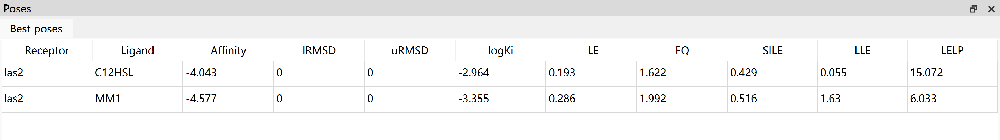
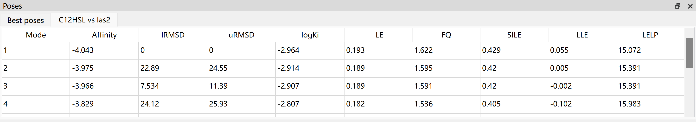
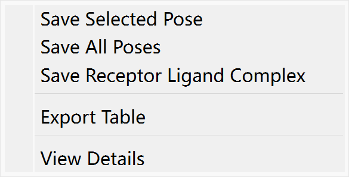
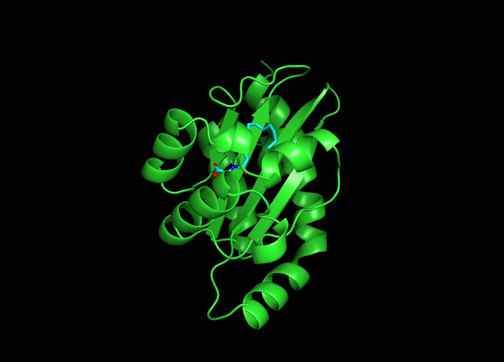

Docking Poses
=============

Pose View
---------

Best poses
~~~~~~~~~~

After docking finished, you can view the best docked poses for each receptor and ligand in pose table.

.. rst-class:: wy-text-center

	|bestpose|

The best pose table contains receptor name, ligand name, affinity (or free binding energy), RMSD score, logKi and some metrics.

**Calculation of logKi**

The Ki millimolar (mM) to yoctomolar (yM) will be converted to Molar (M). And then, calculate the log10 of Molar.

**Calculation of Metrics**

.. list-table::

	* - LE
	  - Ligand efficiency
	  - -∆G/N
	* - SILE
	  - size-Independent Ligand efficiency
	  - -∆G/(N^0.3)
	* - FQ
	  - Fit Quality
	  - LE/(0.0715+7.5328/N+25.7079/(N^2) -361.4722/(N^3))
	* - LLE
	  - Lipophilic ligand efficiency
	  - -log⁡Ki-log⁡P
	* - LELP
	  - Ligand Efficiency dependent Lipophilicity
	  - log⁡P/LE

*where ΔG is the free energy of binding, N is the number of heavy atoms (non-hydrogen atoms) of ligand, Ki is estimated inhibition constant, logP is the calculated octanol-water partition coefficient*

Job poses
~~~~~~~~~

In addition to best poses, the Dockey also allows you to view poses for each docking job. You can click a job in job table, a new tab named *ligand vs receptor* will be display in pose panel.

.. rst-class:: wy-text-center

	|jobpose|

Pose exporting
--------------

The best pose table and job pose table has right-click menu that helps you to export the poses.

.. rst-class:: wy-text-center

	|posemenu|

#. **Save Selected Pose**: Export current selected pose to a pdb file
#. **Save All Poses**: Export all poses to a pdb file
#. **Save Receptor Ligand Complex**: Export compound containing receptor and ligand to a pdb file
#. **Export Table**: Export current table to CSV file
#. **View Details**: View the details of pose including Ki.

Pose Visualization
------------------

You can click one pose in best pose table or job pose table to view the 3D structure of ligand-receptor complex in PyMOL view.

.. rst-class:: wy-text-center

	|poseview|

#. Go to **File** menu -> **Export As Image** to save the 3D structure in PyMOL view to PNG file.
#. Go to **File** menu -> **Export As File** to save the content of PyMOL view to pdb file.

