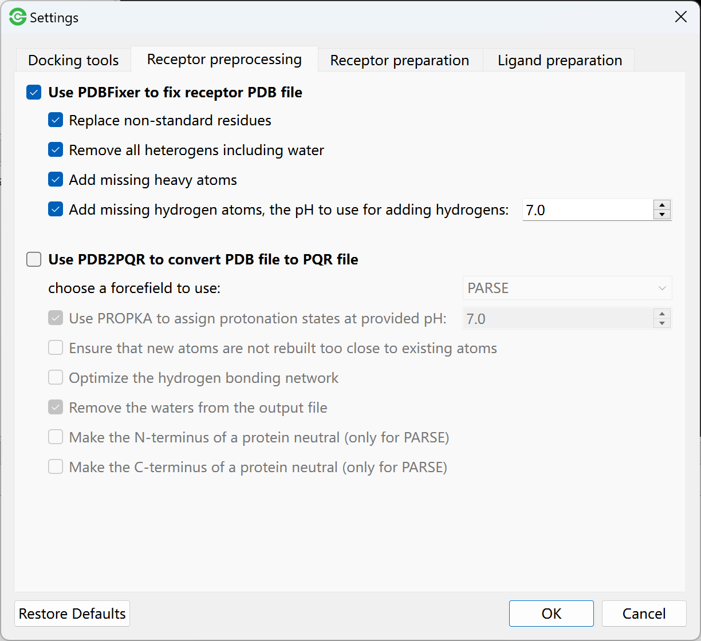

Molecular Preparation
=====================

Receptor Preprocessing
----------------------

You can manually do receptor preprocessing using PyMOL. First, click one receptor in molecular list to view in PyMOL, and then:

#. Go to **Edit** menu -> **Remove Water** to delete water from receptor.
#. Go to **Edit** menu -> **Remove Solvent** to delete solvent from receptor.
#. Go to **Edit** menu -> **Remove Organic** to delete ligand from complex.
#. Go to **Edit** menu -> **Remove Chain** to select a chain to delete.

	.. rst-class:: wy-text-center

		|delchain|

.. note::

	Certainly, you can skip the receptor preprocessing step. The ligand and water will be automatically removed in molecular preparation step.

Receptor Preparation
--------------------

The priority of receptor preparation tools: AutoDockTools > OpenBabel. For example, you can firstly select AutoDockTools as receptor preparation tool. If AutoDockTools failed, you can select OpenBabel as preparation tool.

For `AutoDockTools <https://github.com/lmdu/AutoDockTools_py3>`_, the ``prepare_receptor4.py`` in AutoDockTools was used to prepare receptor and generate PDBQT file. Before starting docking tasks, you can go to **Edit** menu -> **Global Settings** -> **AutoDockTools** -> **Receptor preparation** to set parameters.

Ligand Preparation
------------------

The priority of receptor preparation tools: AutoDockTools > Meeko > OpenBabel. For example, you can firstly select AutoDockTools as ligand preparation tool. If AutoDockTools failed, you can select Meeko as preparation tool. If Meeko failed, select OpenBabel.

For `AutoDockTools <https://github.com/lmdu/AutoDockTools_py3>`_, the ``prepare_ligand4.py`` in AutoDockTools was used to prepare ligands and generate PDBQT file. Before starting docking tasks, you can go to **Edit** menu -> **Global Settings** -> **AutoDockTools** -> **Ligand reparation** to set parameter.

.. |delchain| image:: _static/delchain.png
	:width: 300

.. |mpr| image:: _static/mpr.png
	:width: 600
.. |mpl| image:: _static/mpl.png
	:width: 600
.. |mpm| image:: _static/mpm.png
	:width: 600
