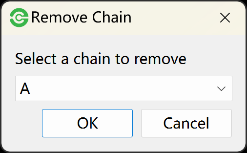
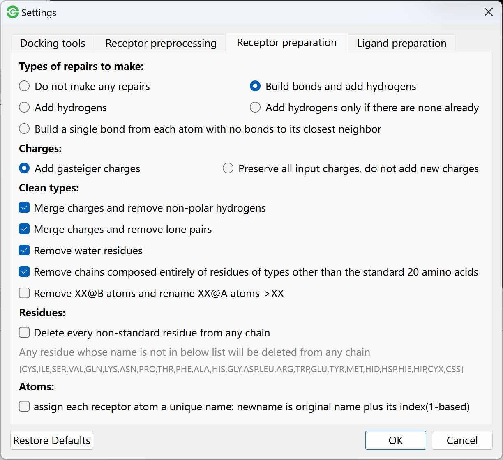
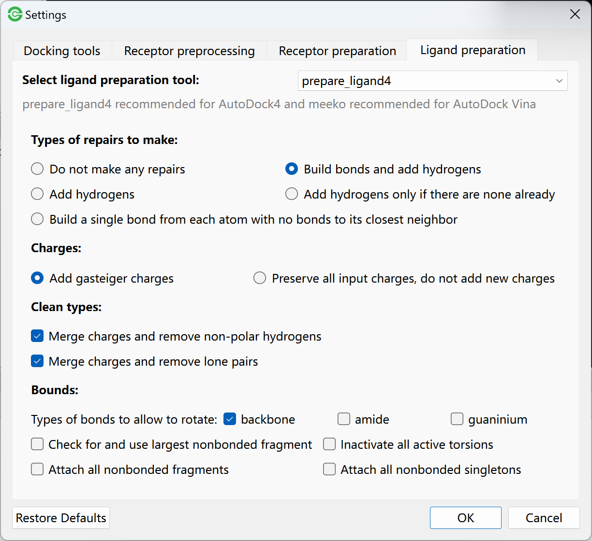
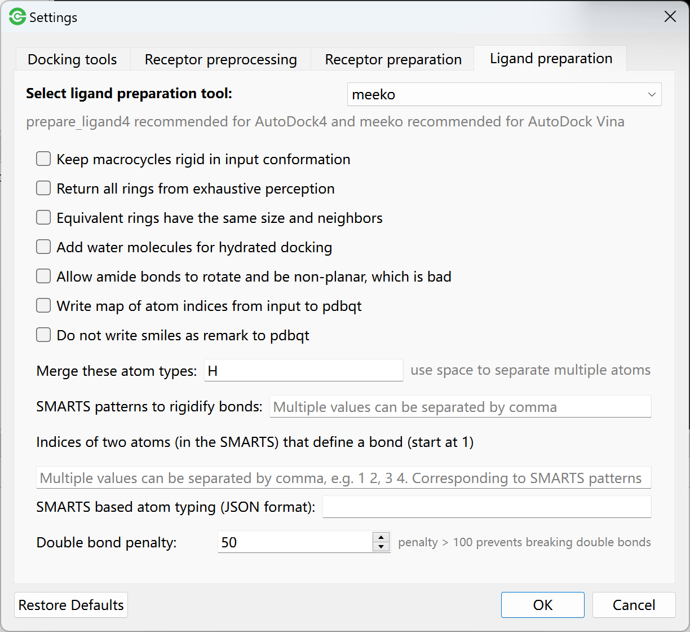

Molecular Preparation
=====================

Receptor Preprocessing
----------------------

First, click one receptor in molecular list to view in PyMOL, and then:

#. Go to **Edit** menu -> **Remove Water** to delete water from receptor.
#. Go to **Edit** menu -> **Remove Solvent** to delete solvent from receptor.
#. Go to **Edit** menu -> **Remove Organic** to delete ligand from complex.
#. Go to **Edit** menu -> **Remove Chain** to select a chain to delete.

.. rst-class:: wy-text-center

	|delchain|

.. note::

	Sometimes you can skip the receptor preprocessing step and remove water in preparing step.

Receptor Preparation
--------------------

Dockey use ``prepare_receptor4.py`` in `AutoDockTools <https://github.com/lmdu/AutoDockTools_py3>`_ to prepare receptor and generate PDBQT file. Before starting docking tasks, you can go to **Edit** -> **Molecular Preparation Settings** to open preparation setting dialog.

.. rst-class:: wy-text-center

	|mpr|

The paramter description can be found in script `prepare_receptor4.py <https://github.com/lmdu/AutoDockTools_py3/blob/master/AutoDockTools/Utilities24/prepare_receptor4.py>`_.

Ligand Preparation
------------------

You can use ``prepare_ligand4.py`` in `AutoDockTools <https://github.com/lmdu/AutoDockTools_py3>`_ or `Meeko <https://github.com/forlilab/Meeko>`_ to prepare ligands and generate PDBQT file. Before starting docking tasks, you can go to **Edit** -> **Molecular Preparation Settings** to open preparation setting dialog, and then click **Ligand** tab to switch to ligand preparation setting page.

Select ``prepare_ligand4`` as ligand preparation tool, you will see the parameters for prepare_ligand4. The parameter description can be found in script `prepare_ligand4.py <https://github.com/lmdu/AutoDockTools_py3/blob/master/AutoDockTools/Utilities24/prepare_ligand4.py>`_.

.. rst-class:: wy-text-center

	|mpl|

Select ``Meeko`` as ligand preparation tool, you will see the parameters for Meeko.

.. rst-class:: wy-text-center

	|mpm|

