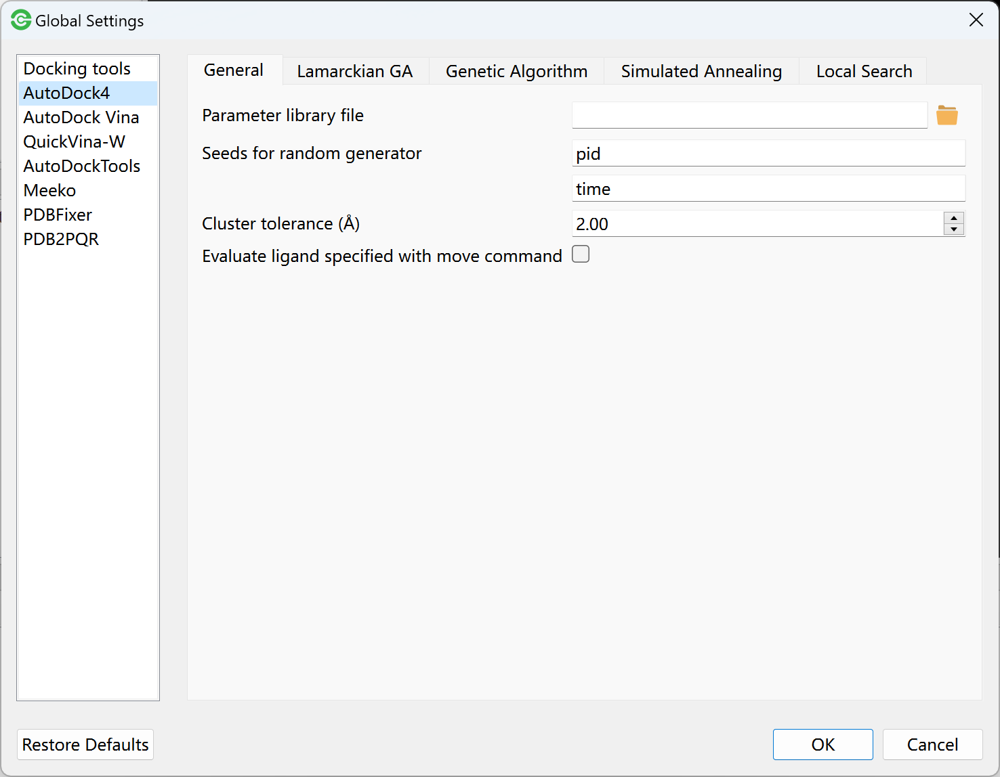
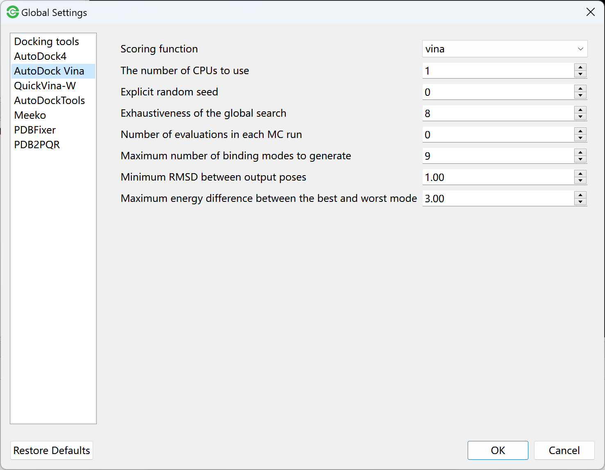
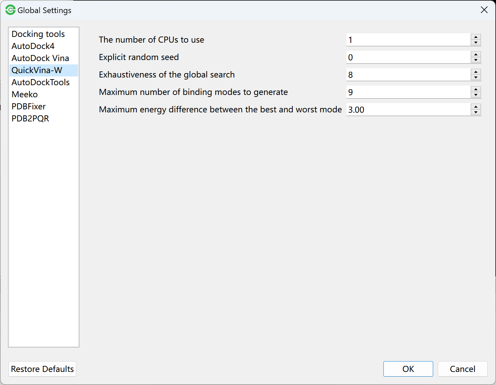
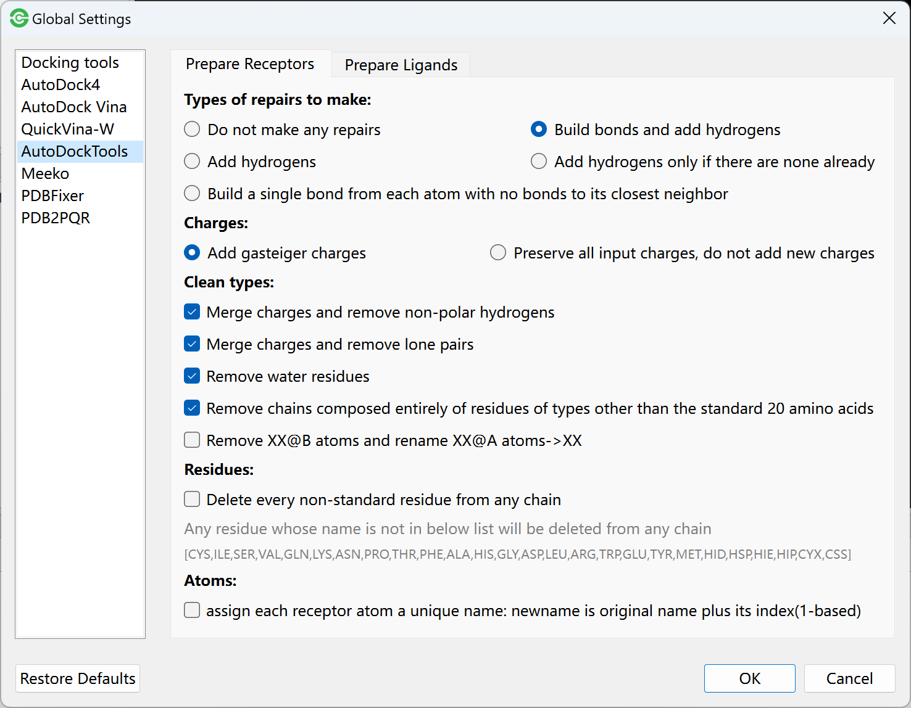
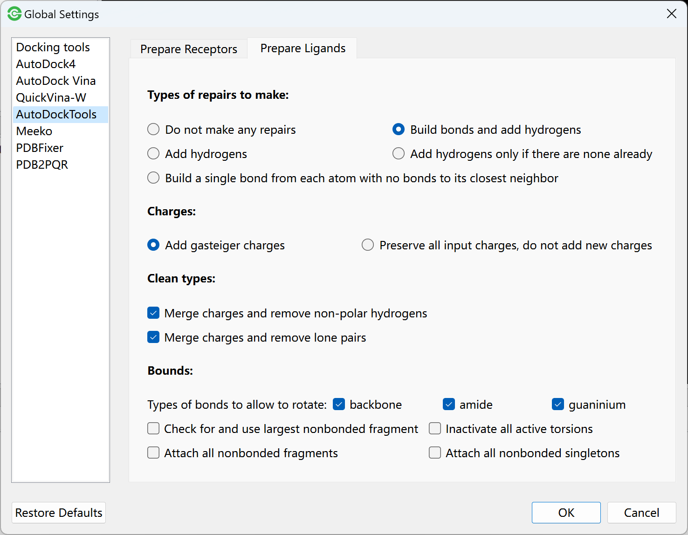
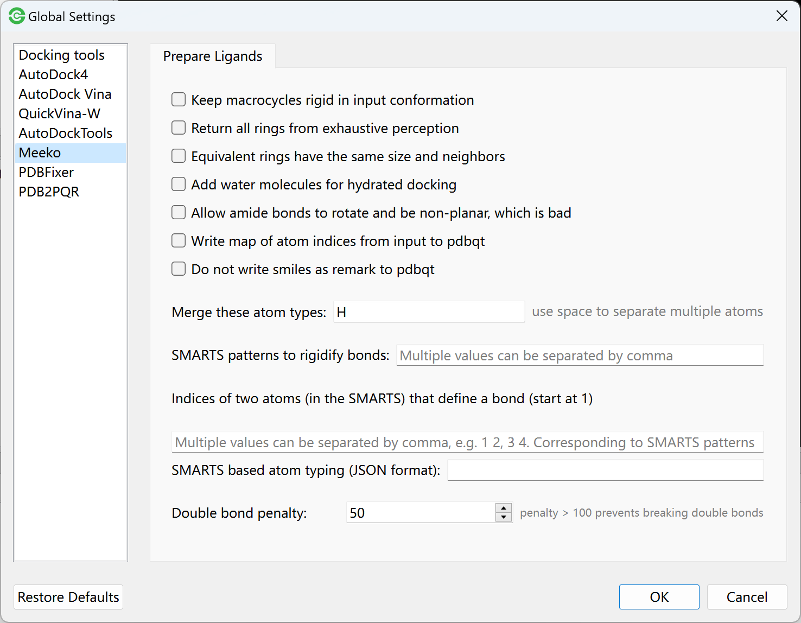
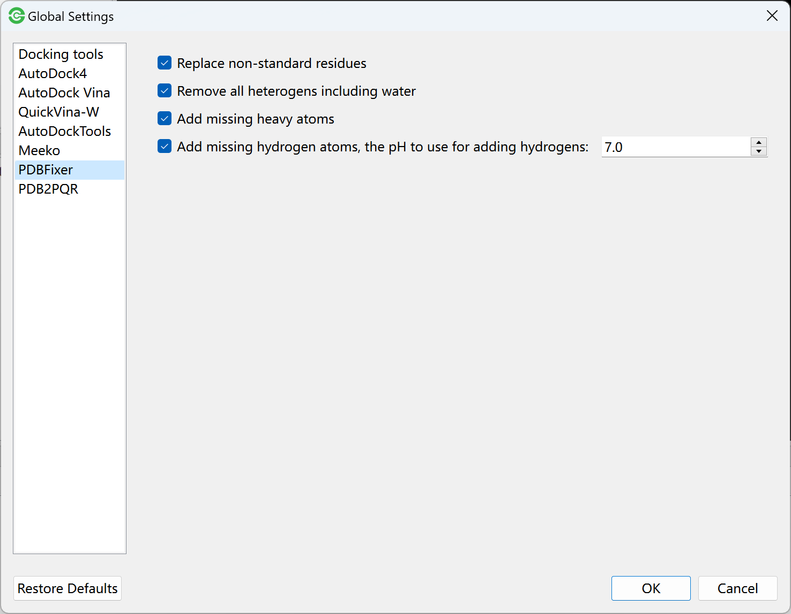
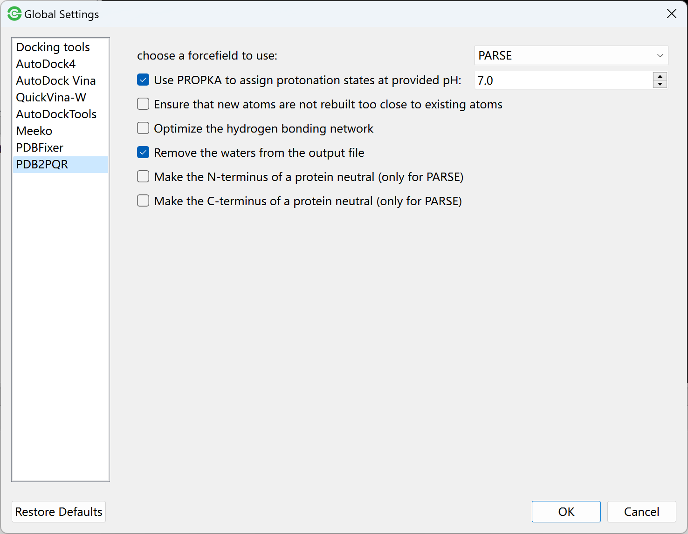

Global Settings
===============

Autodock4 Settings
------------------

Go to **Edit** -> **Global Settings** -> **Autodock4** to set parameters for Autodock4:

.. rst-class:: wy-text-center

	|adset|

In this panel, you can set general parameters and set parameters for each search algorithm.

The meanings of above parameters can be found in `AutoDock4 manual <https://autodock.scripps.edu/wp-content/uploads/sites/56/2021/10/AutoDock4.2.6_UserGuide.pdf>`_. For simplicity, you can use the default value of parameters.

Autodock Vina Settings
----------------------

Go to **Edit** -> **Global Settings** -> **Autodock Vina** to set parameters for Autodock Vina:

.. rst-class:: wy-text-center

	|vinaset|

QuickVina Settings
------------------

Go to **Edit** -> **Global Settings** -> **QuickVina-W** to set parameters for QuickVina:

.. rst-class:: wy-text-center

	|qvinaset|

AutoDockTools Settings
----------------------

Go to **Edit** -> **Global Settings** -> **AutoDockTools** -> **Prepare Receptors** to set parameters for receptor preparation:

.. rst-class:: wy-text-center

	|adtrep|

The paramter description can be found in script `prepare_receptor4.py <https://github.com/lmdu/AutoDockTools_py3/blob/master/AutoDockTools/Utilities24/prepare_receptor4.py>`_.

Go to **Edit** -> **Global Settings** -> **AutoDockTools** -> **Prepare Ligands** to set parameters for ligand preparation:

.. rst-class:: wy-text-center

	|adtlig|

The parameter description can be found in script `prepare_ligand4.py <https://github.com/lmdu/AutoDockTools_py3/blob/master/AutoDockTools/Utilities24/prepare_ligand4.py>`_.

Meeko Settings
--------------

Go to **Edit** -> **Global Settings** -> **Meeko** -> **Prepare Ligands** to set parameters for ligand preparation:

.. rst-class:: wy-text-center

	|meekolig|

PDBFixer Settings
-----------------

Go to **Edit** -> **Global Settings** -> **PDBFixer** to set parameters for PDBFixer:

.. rst-class:: wy-text-center

	|pdbfixer|

PDB2PQR Settings
----------------

Go to **Edit** -> **Global Settings** -> **PDB2PQR** -> to set parameters for PDB2PQR:

.. rst-class:: wy-text-center

	|pdb2pqr|

