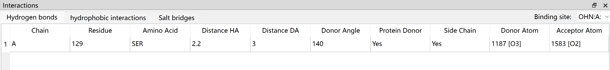
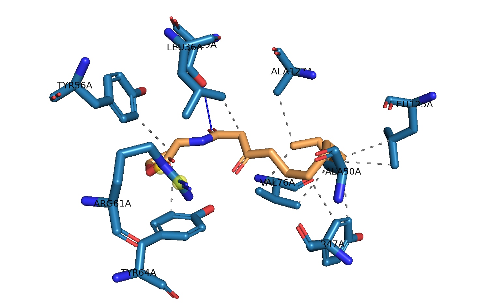

Interactions
============

Dockey use `PLIP <https://github.com/pharmai/plip>`_ to analyze interactions between ligand and receptor. PLIP can detect **Hydrophobic Interactions**, **Hydrogen Bonds**, **π-Stacking**, **π-Cation Interactions**, **Salt Bridges**, **Water Bridges**, **Halogen Bonds**, **Metal Complexes**.

Go to **Best pose table** or **Job pose table**, click one docked pose in table to view interactions in interaction tables.

.. rst-class:: wy-text-center

	|interact|

You can click different tabs to view corresponding interactions.

The meaning of table header for each interaction type can be found in `https://github.com/pharmai/plip/blob/master/DOCUMENTATION.md#interactions-1 <https://github.com/pharmai/plip/blob/master/DOCUMENTATION.md#interactions-1>`_.

You can click a row in interaction table to view 3D structure of interactions in PyMOL view.

.. rst-class:: wy-text-center

	|plip|

The legend of PyMOL visualization can be found in `https://github.com/pharmai/plip/blob/master/DOCUMENTATION.md#legend-for-pymol-visualization <https://github.com/pharmai/plip/blob/master/DOCUMENTATION.md#legend-for-pymol-visualization>`_.

