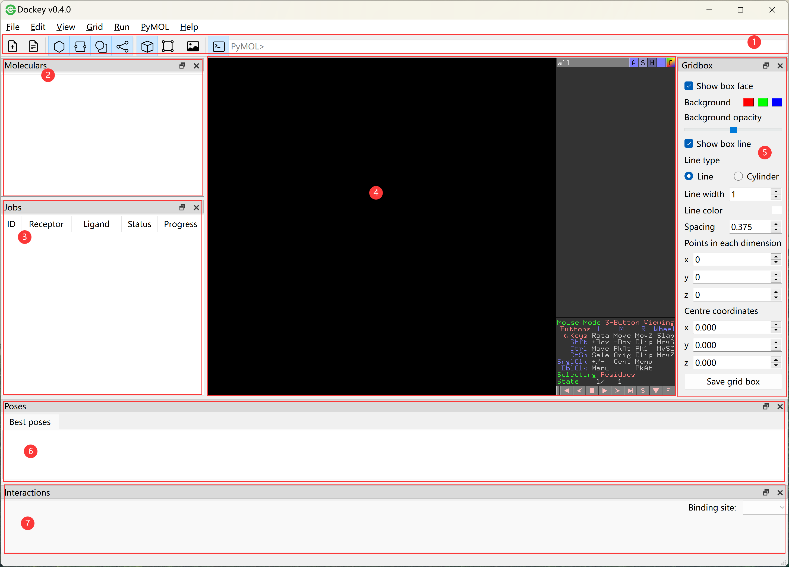

Overview
========

|overview|

**1. Toolbar**

	* |new| click to create a new project file
	* |open| click to open an existing project file
	* |mol| a toggle button to show or hide molecular list
	* |job| a toggle button to show or hide job table
	* |pose| a toggle button to show or hide pose table
	* |share| a toggle button to show or hide interaction table
	* |box| a toggle button to show or hide grid box adjusting panel
	* |share| click to draw a bounding grid box
	* |save| save the pymol view to a png file
	* |cmd| a toggle button to show or hide pymol command input

**2. Molecular list**

	* a list to display receptors and ligands 

**3. Job table**

	* a table to show all docking jobs

**4.  PyMOL view**

	* used to visualize the 3D structure of molecules, conformations and interactions

**5. Grid box panel**

	* a panel for adjusting grid box size and position

**6. Pose table**

	* a table to show best docking poses for all ligands and receptors as well as poses for certain job

**7. Interaction table**

	* a table to show interactions between ligand and receptor for certain pose

.. |new| image:: _static/new.svg
	:width: 28
.. |open| image:: _static/open.svg
	:width: 28
.. |mol| image:: _static/molecular.svg
	:width: 28
.. |job| image:: _static/job.svg
	:width: 28
.. |pose| image:: _static/pose.svg
	:width: 28
.. |share| image:: _static/share.svg
	:width: 28
.. |box| image:: _static/box.svg
	:width: 28
.. |grid| image:: _static/bounding.svg
	:width: 28
.. |save| image:: _static/image.svg
	:width: 28
.. |cmd| image:: _static/cmd.svg
	:width: 28