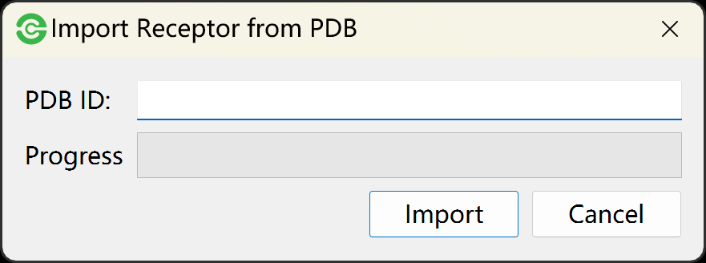
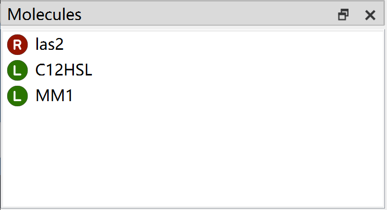

Molecular Preparation
=====================

Project file
------------

Firstly, you should create or open a project file before docking. Go to **File** menu -> **New Project** or Go to **Toolbar** -> |new|, and then input a name to create a new project file with *.dock* extension.

If you have a project file with *.dock* extension that created by Dockey software, you can go to **File** menu -> **Open Project** to open it.

Certainly, you can go to **File** menu -> **Save Project As** to save current opened project to another file. you can also go to **File** menu -> **Close Project** to close the opened project file.

Import molecules
----------------

After creating or opening project file, you will be allowed to import receptors and ligands. The Dockey supports various formats that can be read by `OpenBabel <http://openbabel.org/docs/current/FileFormats/Overview.html>`_.

.. note::

	The Dockey will identify molecule file format through extension name. Please make sure that the molecule file extension is identical with its content.

Import Receptors
~~~~~~~~~~~~~~~~

#. Go **File** menu -> **Import Receptors** to select receptor files and import to Dockey.
#. Go **File** menu -> **Import Receptor from PDB** to open a dialog, and then input an PDB ID and click ``Import`` button. The Dockey will automatically download the molecule from `RCSB PDB <https://www.rcsb.org/>`_ database and import it.

.. rst-class:: wy-text-center

	|pdb|

Import Ligands
~~~~~~~~~~~~~~

#. Go **File** menu -> **Import Ligands** to select ligand files and import to Dockey.
#. Go **File** menu -> **Import Ligand from Zinc** to open a dialog, and then input an Zinc ID, select Zinc version (15 or 20), and click ``Import`` button. The Dockey will automatically download the molecule from `Zinc <https://zinc.docking.org/>`_ database and import it.

.. rst-class:: wy-text-center

	|zinc|

Molecular List
--------------

The imported ligands and receptors will be separately displayed in molecular list.

.. rst-class:: wy-text-center

	|mol|

The molecular list has right-click menu. You can use **Import Receptors** and **Import Ligands** in menu list to import receptor and ligand files.

.. rst-class:: wy-text-center

	|molmenu|

You also allowed to use **Delete** to remove current selected molecule and **Delete All** to remove all molecules from Dockey.

You can use **View Details** to obtain detailed information of molecule including number of atoms, bonds, heavy atoms, residues and rotors, formula, molecular weight as well as calculated *logp*.

.. rst-class:: wy-text-center

	|molinfo|

Receptor Preprocessing
----------------------

First, click one receptor in molecular list to view in PyMOL view, and then:

#. Go to **Edit** menu -> **Remove Water** to delete water from receptor.
#. Go to **Edit** menu -> **Remove Solvent** to delete solvent from receptor.
#. Go to **Edit** menu -> **Remove Organic** to delete ligand from complex.
#. Go to **Edit** menu -> **Remove Chain** to select a chain to delete.

	.. rst-class:: wy-text-center

		|delchain|

.. |new| image:: _static/new.svg
	:width: 22

.. |delchain| image:: _static/delchain.png
	:width: 300