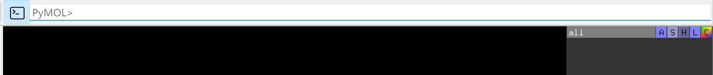

Visualization
=============

Dockey use `PyMOL <https://github.com/schrodinger/pymol-open-source>`_ to view 3D structure of molecules, poses, interactions. The PyMOL usage can be found in `https://pymolwiki.org/index.php/Practical_Pymol_for_Beginners <https://pymolwiki.org/index.php/Practical_Pymol_for_Beginners>`_.

.. rst-class:: wy-text-center

	|pymol|

Go to **View** menu -> **Show Pymol Sidebar** to open PyMOL right sidebar to use advanced functions.

Go to **View** menu -> **Show Pymol Command** or click |pymolcmd| button to open PyMOL input field which allows you to input PyMOL commands to manipulate the view.

You also can go to **PyMOL** menu to select action to manipulate the view.

.. rst-class:: wy-text-center

	|pymolin|

Go to **View** menu -> **Show Pymol feedback** to show pymol output messages.

.. rst-class:: wy-text-center

	|pymolfb|

.. |pymol| image:: _static/pymol.png

.. |pymolfb| image:: _static/pymolfb.png